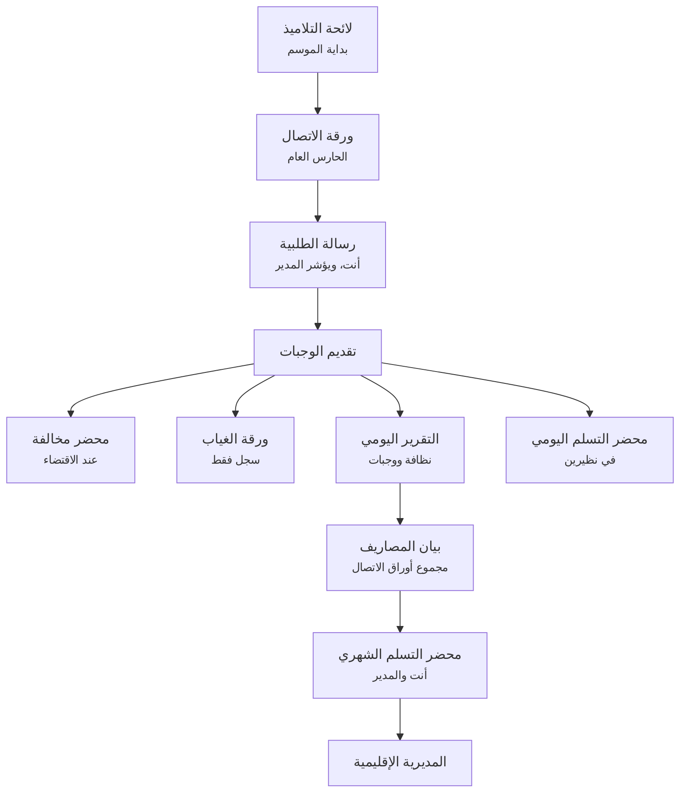

# Document chain

This is the flow SKILL.md §3 points to: which document triggers the next
one, who's on each step, and how the daily/monthly/as-needed tiers connect.
`documents.md` has the field-by-field spec for each one; this file has the
*order* and *why*. Source: a process diagram the user drew from their own
real workflow (2026-08-08) — this file transcribes it exactly, then notes
where the current code does and doesn't match it yet.

## The chain, stage by stage

1. **لائحة التلاميذ** (`roster_status`) — start of year. Feeds everything
   downstream; nothing else can be generated for a student who isn't here.
2. **ورقة الاتصال** (`contact_sheet`) — every morning. Owner: الحارس العام
   (WARDEN). The daily starting point everything else keys off.
3. **رسالة الطلبية** (`order_letter`) — generated from that day's
   `contact_sheet`. Owner: STEWARD ("أنت"), initialled by HEADMASTER
   ("ويؤشر المدير"). Sent to the contractor.
4. **تقديم الوجبات** — the meals actually get served. Not a document, not a
   screen — the real-world event that happens in between. This is the pivot
   point: everything before it is about *ordering* the meals, everything
   after it is about *recording what actually happened*.
5. From تقديم الوجبات, two things can follow:
   - **محضر مخالفة** (`infraction_record`) — only إذا لزم الأمر (عند
     الاقتضاء / as-needed), if something went wrong with the delivery.
   - Three parallel same-day records, all owned by the day itself:
     - **ورقة الغياب** (`absence_sheet`) — سجل فقط (log only) — only exists
       for a day when someone was actually absent.
     - **التقرير اليومي** (`daily_report`) — نظافة ووجبات (hygiene +
       meals), the مسير's inspection checklist.
     - **محضر التسلم اليومي** (`daily_reception_record`) — في نظيرين (in
       two copies), confirms delivery was accepted.
6. **بيان المصاريف** (`monthly_expense_statement`) — end of month, مجموع
   أوراق الاتصال (sum of the month's `contact_sheet`s — not the daily
   reports; the diagram draws the arrow through التقرير اليومي's column for
   layout only, the real source data is the contact sheets, matching
   `documents.md` §8's "Aggregates the month's actual attendance").
7. **محضر التسلم الشهري** (`monthly_reception_record`) — أنت والمدير
   (STEWARD + HEADMASTER), sent on together with the expense statement.
8. **المديرية الإقليمية** — not a document, the final recipient. End of the
   chain.

## Tiers (matches the diagram's colour legend)

| Tier | Documents |
|---|---|
| يومي (daily) | `contact_sheet`, `order_letter`, `absence_sheet`, `daily_report`, `daily_reception_record` |
| شهري (monthly) | `monthly_expense_statement`, `monthly_reception_record` |
| عند الاقتضاء (as-needed) | `infraction_record` |

`roster_status` sits outside all three tiers — it's a season-start/on-change
event, not a recurring one.

## Where the current code stands against this chain

`CONFIRM:` everything below with the user before treating it as settled —
this section is this session's read of `src/`, not something the user
signed off on field-by-field.

- **Built and matches**: `roster_status` (لائحة التلاميذ), `contact_sheet`
  (ورقة الاتصال اليومية), `order_letter` (رسالة الطلبية — generated from
  the day's `contact_sheet`, per step 3 above), `absence_sheet` (ورقة
  الغياب اليومي), `daily_report` (التقرير اليومي), `infraction_record`
  (محضر المخالفة / `infraction_record_screen.py` — the PV against the
  CATERING COMPANY. A separate دفتر المخالفات student-discipline screen used
  to exist; the user confirmed 2026-08-28 that no such document exists in
  their job and it was deleted), `monthly_expense_statement` (بيان
  المصاريف).
- **Not built yet — genuinely missing, not just renamed**: confirmed by
  checking `src/core/models.py`'s class list, `src/ui/main_window.py`'s
  sidebar, and a repo-wide search for "تسليم"/"نظيرين"/"reception" — none
  of these turn up anything.
  - **محضر التسلم اليومي** (`daily_reception_record`) — two-copy daily
    delivery confirmation. No screen, no model, no data-layer function.
  - **محضر التسلم الشهري** (`monthly_reception_record`) — the final
    two-copy form sent to المديرية الإقليمية together with the expense
    statement. No screen, no model, no data-layer function.
- **Resolved — not a name collision, two genuinely different documents.**
  Confirmed by the user directly (2026-08-08) and by real template files
  they added the same day: `templets/المحضر اليومي لتسلم الخدمة.docx` and
  `templets/المحضر الشهري لتسلم الخدمة.docx` (both bilingual French/Arabic
  "PROCES VERBAL DE RECEPTION" forms, distinct from
  `monthly_report_screen.py`'s existing "المحضر الشهري", which has no
  template at all and just aggregates net meals + cost on-screen). The
  daily and monthly PVs are related the way the user described it: daily
  records accumulate through the month, and the monthly PV is the
  collected/signed summary of them — not a duplicate of the existing
  net-cost screen.
  - **محضر اليومي لتسلم الخدمة** template fields (extracted from the real
    .docx): school year, a `date` mergefield, a signer table (CHEF
    D'ETABLISSEMENT / ECONOME — i.e. HEADMASTER + STEWARD), an attestation
    paragraph naming the contract number and contractor, and a 3-row items
    table (petit-déjeuner/déjeuner/dîner) with quantity mergefields
    `عدد_المستفيدين_الفطور` / `عدد_المستفيدين_الغذاء` — **the same
    per-meal totals already computed for `contact_sheet`**, just in this
    official bilingual format. Likely buildable largely from existing
    data, plus the new template-fill + a signer table (3 roles: STEWARD,
    HEADMASTER, CONTRACTOR per `documents.md` §6).
  - **محضر الشهري لتسلم الخدمة** template: same shape, "au titre du mois"
    (for the month of ...) instead of a specific date, same 3-row items
    table, 3 signers (Directeur / Gestionnaire / Le prestataire de
    service — HEADMASTER + STEWARD + CONTRACTOR, matching `documents.md`
    §9's STEWARD/HEADMASTER... `CONFIRM:` documents.md doesn't currently
    list CONTRACTOR as a signer for this one, but the real template does —
    the template wins per SKILL.md §8).
  - Not built yet — this section documents what's needed, not a decision
    to build it. Ask before starting; it's a real multi-file feature (new
    `core/models.py` classes, `data/` functions, 2 new screens or one
    combined one, DOCX/PDF export, sidebar + يوم العمل wiring, tests).
- **Also implicit in the chain but not drawn**: `order_letter` needs that
  day's approved weekly meal program too (see `documents.md` §3) — the
  weekly meal program itself (البرنامج الغذائي الأسبوعي) doesn't appear in
  this diagram at all, presumably because it isn't itself a signed
  per-instance document in the ministry process, just a standing input.
